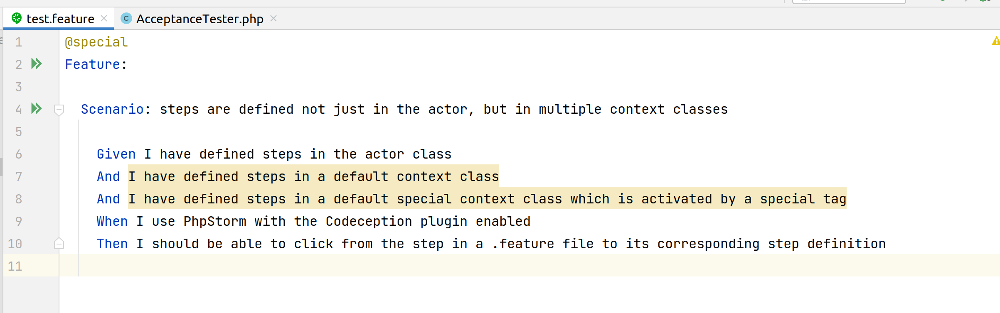

An example that reproduces https://youtrack.jetbrains.com/issue/WI-34963



Codeception is able to find all the step definitions, but PhpStorm isn't (yet): 

```bash
vendor/bin/codecept run acceptance
```
